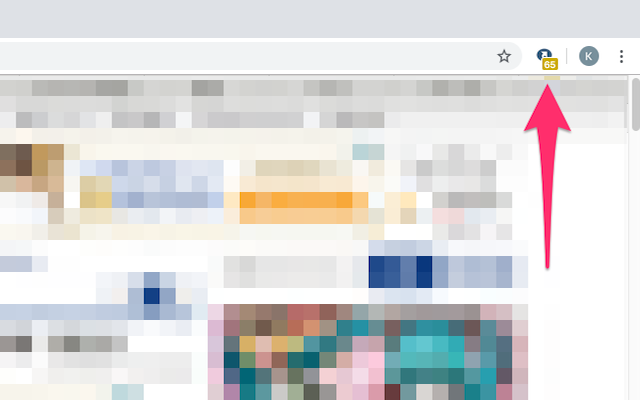

# Ceron comments (Unofficial)

[Ceron](https://ceron.jp/)の非公式WebExtension

Ceronのコメント数(記事のツイート数)を表示します。

* [Chrome Web Store](https://chrome.google.com/webstore/detail/ceron-comments-unofficial/kkibdojmpelnpbddhlfpopflikkokcko?hl=ja&gl=JP)
* [Firefox Add-ons](https://addons.mozilla.org/ja/firefox/addon/ceron-comments-unofficial/)



似てるやつ

* [ツイートカウンター for Twitter - Chrome ウェブストア](https://chrome.google.com/webstore/detail/tweets-counter-for-twitte/ampfabjhdfinfhdekjdmgflefglnfhja?hl=ja)

# build

with npm

```
$ npm install
$ npm run build
```

with yarn

```
$ yarn init
$ yarn run build
```